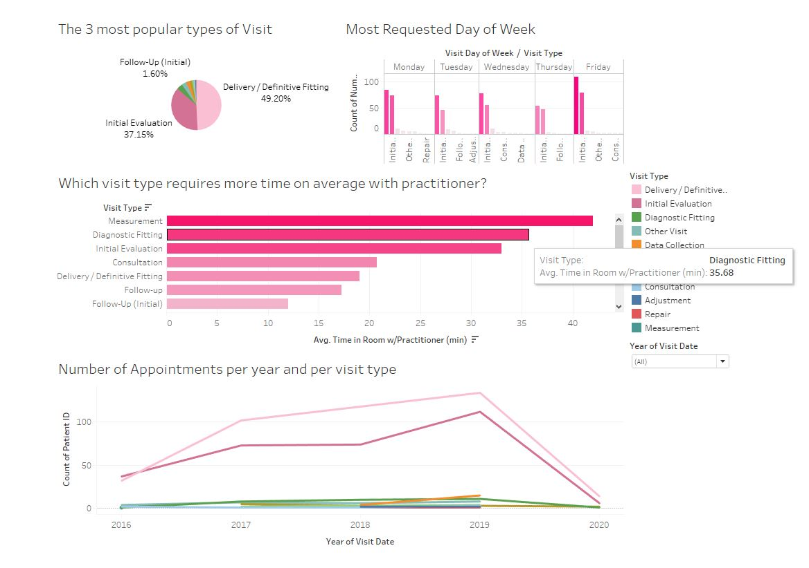
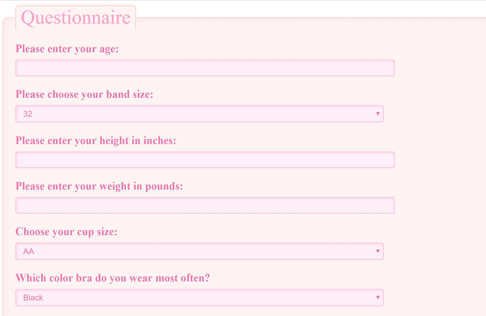

# Think Pink Project

For this project, we did a data analysis for the company San Francisco Prosthetic Orthotic Service’s mastectomy department. Our goal is to help the company make informed business decisions by creating appropriate datasets and visualizations that can be used to solve problems, predict trends, and increase the department’s efficiency, productivity, and revenue for long   -term growth. Based on the data collected and processed, we also wanted to enhance patient care by providing a way for patients to more easily access mastectomy services. There are only a few places in the bay area that provide mastectomy care. We want to provide patients who may have difficulty traveling with a way of finding the appropriate fit for the bras and prosthesis.

All protected health information (PHI) was removed before any analysis was performed.

## Business Analysis – Tableau

After the data was collected and cleaned using excel, python, and pandas, we used Tableau to produce an in   -depth analysis and visualizations. We created interactive dashboards that displayed the following:

1. Appointment Type Analysis:
   - Distribution of records by visit type
   - Most requested day of the week for appointments
   - Average clinician time spent per patient by visit type
   - Total number of appointments by year
2. Patient Management Analysis:
   - Average clinician time with patient overall by month and year
   - Patient wait times in lobby
   - Correlation between wait time and day of appointment
3. Insurance Analysis:
   - Breakdown of patient’s primary insurances
   - Top insurance payers
   - Insurance payments vs. cost of goods per patient
4. Device Analysis:
   - Device type prescribed
   - Breakdown of devices by patient’s age
   - Insurance payments by device type

   

## Bra Fit Recommendation – Machine Learning and Interactive App

Data was collected on over 500 patients’ bra fit based on age, height, weight, and other factors. We wanted to use machine learning to help patients who did not have access to a mastectomy fitter get a good recommended bra style fit. We created an online questionnaire that a user can fill out to get a recommended bra style based on past data of bras that fit well for other patients with similar size and conditions. 

The decision tree model was the machine learning algorithm that had the best accuracy. We looked at SVM, KNN, and random forest as well. 

 

After the questionnaire form is filled out and submitted, our saved decision tree algorithm will predict which bra style would fit the best. We used *pickle* in order to save and load the model.

The recommended bra name and a photo of the bra will be displayed on a new web page.

![Bra Recommendation] (Main/Images/recommendation.PNG)

## Conclusions

We had some difficulty merging all the multiple datasets but we were able to use a join method in Tableau to get our dashboards to flow smoothly. In order to find the best machine learning model, we had to test out several different methods to find the one with the highest accuracy. 

After completing the analysis, we were able to provide business insights to the company regarding patient management, insurance rates, and inventory forecasting. A standard data entry method that is used across the company should also be implemented for better future analysis.

In the future, we would like to gather more data to train our model for better and more accurate predictions. We would also like to look at more factors that affect the fit of the bra. Ultimately, we would like to be able to provide patients for a way to get a good prediction for not only which bra would fit best, but which type of prosthesis as well. We would like to make the interactive interface more user friendly and visually compelling.

## Tools:
- Python
- Flask
- Tableau
- Excel
- Pandas
- HTML/CSS
- Pickle
- Scikit-learn

## Resources:
- https://towardsdatascience.com/the-5-clustering-algorithms-data-scientists-need-to-know-a36d136ef68
- https://towardsdatascience.com/a-guide-to-decision-trees-for-machine-learning-and-data-science-fe2607241956 
- https://www.youtube.com/watch?v=RmajweUFKvM 
- https://machinelearningmastery.com/implement-decision-tree-algorithm-scratch-python/  
- https://www.datacamp.com/community/tutorials/svm-classification-scikit-learn-python 
- http://www.blog.pythonlibrary.org/2017/12/14/flask-101-adding-editing-and-displaying-data/
- https://code.likeagirl.io/principal-component-analysis-dimensionality-reduction-technique-step-by-step-approach-ffd46623ff67
- https://www.w3schools.com/
- https://www.geeksforgeeks.org/
- https://stackoverflow.com/
- https://flask.palletsprojects.com/en/1.1.x/
- https://www.tableau.com/

